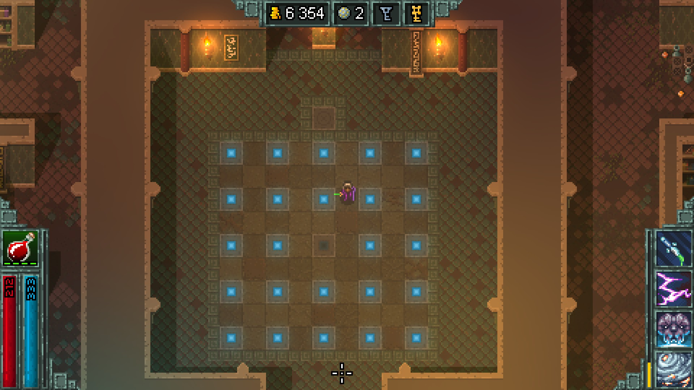

# Lights Out Puzzle

This python script was written to automatically solve the variant of the
[Lights Out Puzzle](http://mathworld.wolfram.com/LightsOutPuzzle.html)
found in the [Hammerwatch](https://en.wikipedia.org/wiki/Hammerwatch) indie game
series.



Also, script can generate random puzzle and let you solve it manually.

```
$ ./hm.py 
# type "?" or "h" for help

> n 5 5
   a  b  c  d  e 
  ++++++++++++++++
1 !▒▒!▒▒!▒▒!▒▒!▒▒!
  ++++++++++++++++
2 !▒▒!▒▒!▒▒!▒▒!▒▒!
  ++++++++++++++++
3 !▒▒!▒▒!▒▒!▒▒!▒▒!
  ++++++++++++++++
4 !▒▒!▒▒!▒▒!▒▒!▒▒!
  ++++++++++++++++
5 !▒▒!▒▒!▒▒!▒▒!▒▒!
  ++++++++++++++++

> rr
   a  b  c  d  e 
  ----------------
1 |▒▒|▒▒|  |▒▒|  |
  ----------------
2 |  |▒▒|  |  |▒▒|
  ----------------
3 |  |▒▒|▒▒|  |▒▒|
  ----------------
4 |  |▒▒|▒▒|▒▒|▒▒|
  ----------------
5 |  |▒▒|  |  |  |
  ----------------

> f c4
   a  b  c  d  e 
  ----------------
1 |▒▒|▒▒|  |▒▒|  |
  ----------------
2 |  |▒▒|  |  |▒▒|
  ----------------
3 |  |▒▒|  |  |▒▒|
  ----------------
4 |  |  |  |  |▒▒|
  ----------------
5 |  |▒▒|▒▒|  |  |
  ----------------

>  
```
